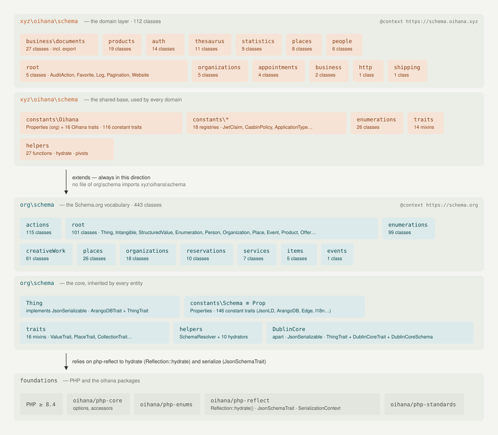
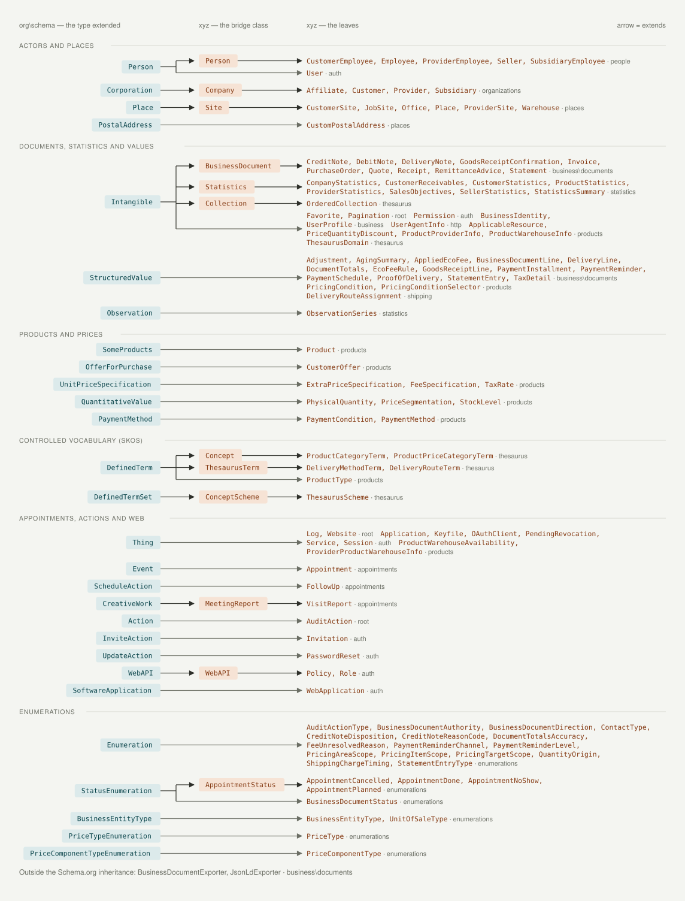
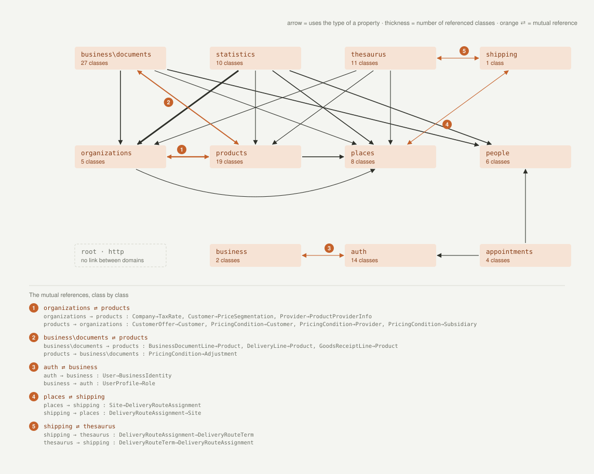

# Architecture — how `xyz\oihana\schema` sits on `org\schema`

The library is built in two storeys. **`org\schema`** carries the Schema.org vocabulary and the core every entity inherits: `Thing`, the `Schema` constants, the traits, the hydrators. **`xyz\oihana\schema`** is the house layer: domain types grouped in domains, which extend Schema.org types and stamp their documents with the `https://schema.oihana.xyz` context. The dependency runs one way: no file of `org\schema` imports the house layer.

This page gives three views of that architecture. The figures are not drawn by hand: they are **measured from `src/`** by a script — class counts, `extends` clauses, `use` statements — and regenerated with one command (see [Regenerating the figures](#regenerating-the-figures)). What they show is the state of the code at the last generation, not an intention.

> 🇫🇷 Cette page est aussi disponible en [français](../fr/architecture.md).

---

## Figure 1 — Two storeys on one base



Each storey has the same anatomy: **domains** on top, a shared **base** underneath — constants, traits, enumerations, hydrators. The arrows always point down.

**Reading**

- **The Oihana base mirrors the Schema.org base feature for feature.** `constants\Oihana` takes `Properties` — every property constant of `org\schema` — and adds its own traits; `helpers` extends the hydrators; `traits` adds the ingestion (`Set*`) and measurement (`Has*`) mixins.
- **The counters say where the mass lives.** On the Schema.org side, actions and enumerations weigh close to half of the vocabulary. On the Oihana side, business documents and products dominate.

## Figure 2 — The anchors



Every Oihana class descends from a Schema.org type: that is its **anchor**. When several classes of one domain share a common specialization, a **bridge class** carries it — the middle column — and the concrete classes, the **leaves**, hang from it. When there is nothing to share, the leaf grafts directly onto the Schema.org type: the arrow then crosses the middle column, in grey.

**Reading**

- **The actors go through a single bridge.** `Person`, `Company` and `Site` carry the people, the companies and the places: any rule common to a family — an identifier, an ingestion, an additional property — has a natural home. `BusinessDocument` and `Statistics` play the same part for their families.
- **`Intangible` and `StructuredValue` are the two hubs.** The value objects of the business documents, the pricing conditions, the statistics: close to half of the domain classes descend from one or the other, most of them without an intermediate class. That is the mark of a layer made of *value objects* more than of *entities*.
- **Products plug in at several points.** `SomeProducts`, `OfferForPurchase`, `UnitPriceSpecification`, `QuantitativeValue`, `PaymentMethod`: it is the domain closest to the Schema.org vocabulary, and the one that will follow it most closely at each evolution.
- **The Oihana enumerations extend `Enumeration`** — or one of its specializations — exactly like the Schema.org ones: an appointment status is handled like an event status.

## Figure 3 — Who talks to whom in the Oihana layer



An arrow goes from one domain to another when one of its classes **imports** a type of the other — almost always to type a property: a document line points at a `Product`, a statistic points at a `Customer`. The thickness counts the referenced classes. The pairs that reference each other are in orange, numbered, and detailed class by class under the graph.

**Reading**

- **Four entity domains are consumed by all the others**: `organizations`, `products`, `places` and `people`. They are the *nouns* of the business; the other domains are its *sentences* — documents, statistics, thesaurus, shipping, appointments.
- **A cycle between two domains is not a fault in a data schema** — a customer has prices, a price targets a customer. It only says that these two domains are not published one without the other, and sets the order in which they are read.
- **The domains without an arrow are the ones that can be taken out as they are** — at the time of writing, `http` and the root.

## Regenerating the figures

```bash
composer schema:diagrams
```

The command runs [`tools/generate-architecture-diagrams.php`](../../tools/generate-architecture-diagrams.php), which walks `src/` and rewrites the six files `assets/images/architecture-*-{fr,en}.svg`. The output is deterministic: two runs on the same sources write the same bytes, so a diff on the SVG files means the code moved.

What the script **measures**:

- the number of classes per sub-namespace, the list of root classes, the number of traits, of constant registries, of helper functions;
- the `extends` clause of every Oihana class, climbed up to the first Schema.org type — the anchor — noting the bridge class when there is one;
- the `use` statements between Oihana sub-namespaces, constants, enumerations and helpers excluded;
- the one-way dependency: should a file of `org\schema` ever import `xyz\oihana\schema`, figure 1 would say so, and the script would report it.

What the script **declares**, at the top of the file, because it cannot be measured:

- `ANCHOR_SECTIONS` — the section each anchor is drawn in (actors, values, products, SKOS, actions, enumerations). A new anchor shows up in an "Other anchors" section, and a notice on `stderr` asks to file it.
- `COUPLING_GRID` — the cell of each domain on the coupling graph. A new domain is drawn on an extra row, with the same notice.
- `XYZ_SPLIT_DOMAINS` — the nested sub-namespaces drawn as domains of their own (`business\documents`).
- a few labels and the examples quoted in the boxes; an example that no longer exists disappears silently.

When to run it: whenever a class changes parent, a domain or an anchor appears, or before freezing a release. The SVG files are committed together with the code change that moved them.

---

## See also

- [Schema.org vocabulary](schema-org/README.md) — the `org\schema` base.
- [The Oihana extensions](oihana/README.md) — the house layer, domain by domain.
- [Why an ontology](why-an-ontology.md) — the vision behind the two storeys.
- [Getting started](getting-started.md) — install, hydration, JSON-LD serialization.
