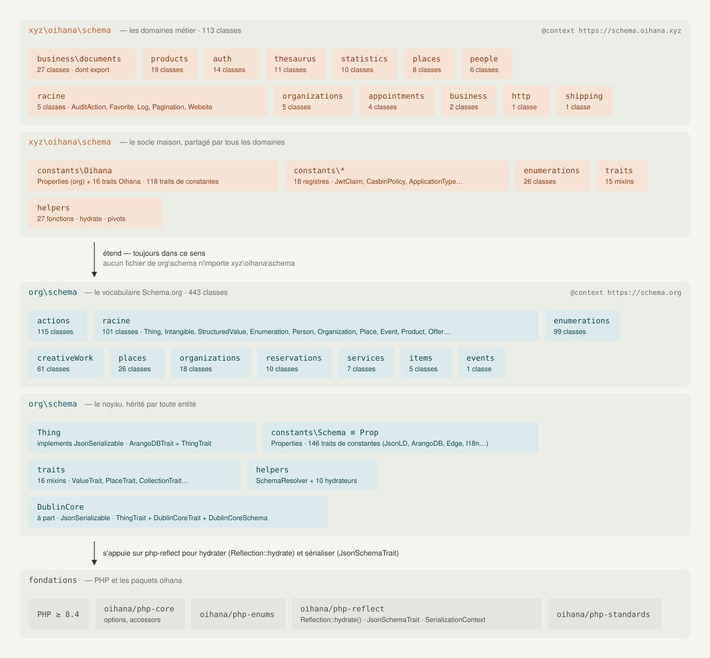
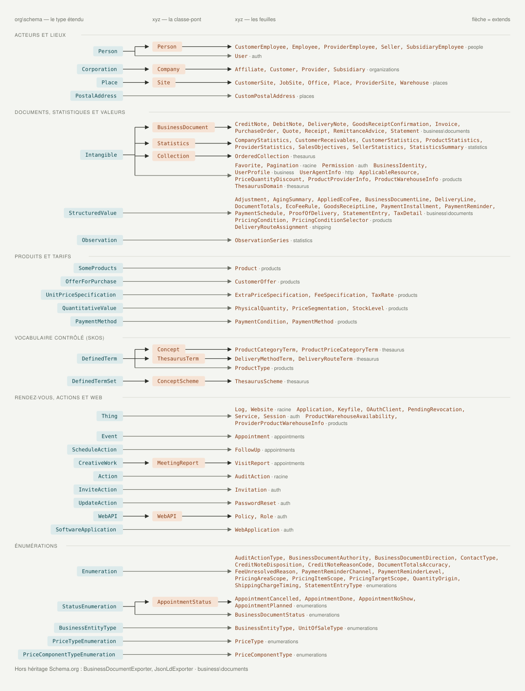
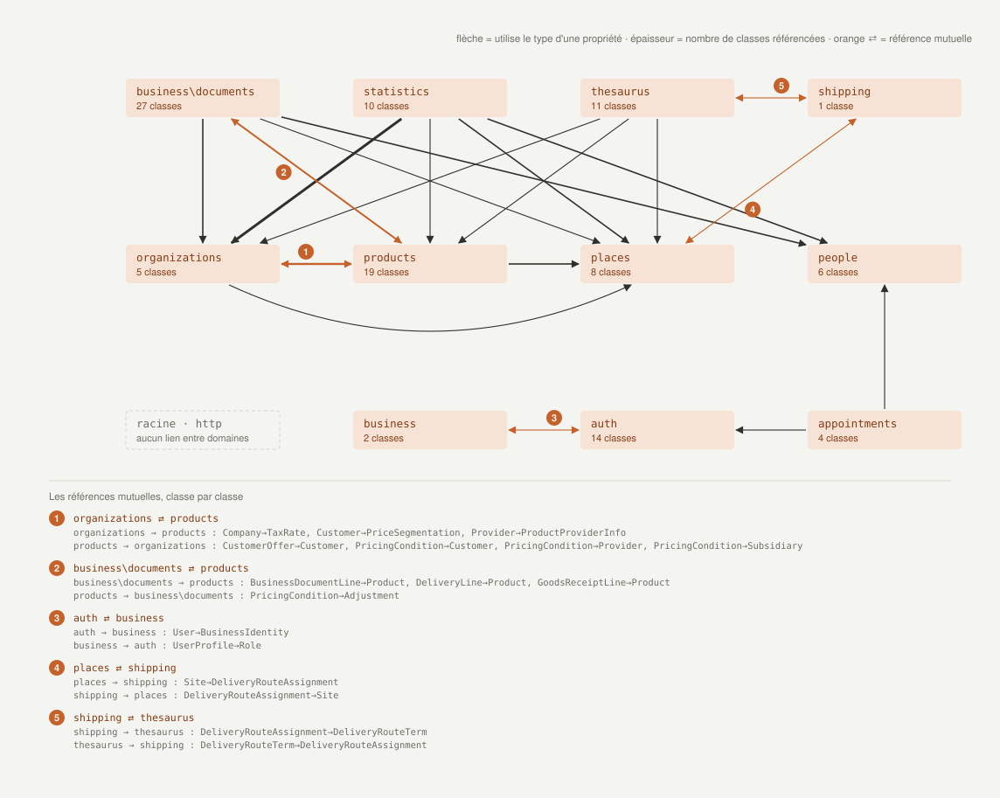

# Architecture — comment `xyz\oihana\schema` se pose sur `org\schema`

La bibliothèque est faite de deux étages. **`org\schema`** porte le vocabulaire Schema.org et le noyau que toute entité hérite : `Thing`, les constantes `Schema`, les traits, les hydrateurs. **`xyz\oihana\schema`** est la couche maison : des types métier répartis en domaines, qui étendent des types Schema.org et signent leurs documents du contexte `https://schema.oihana.xyz`. La dépendance va dans un seul sens : aucun fichier de `org\schema` n'importe la couche maison.

Cette page donne trois vues de cette architecture. Les figures ne sont pas dessinées à la main : elles sont **mesurées dans `src/`** par un script — compteurs de classes, clauses `extends`, instructions `use` — et régénérées d'une commande (voir [Régénérer les figures](#régénérer-les-figures)). Ce qu'elles montrent est l'état du code à la dernière génération, pas une intention.

> 🇬🇧 This page is also available in [English](../en/architecture.md).

---

## Figure 1 — Deux étages sur un socle



Chaque étage a la même anatomie : des **domaines** au-dessus, un **socle** partagé en dessous — constantes, traits, énumérations, hydrateurs. Les flèches descendent toujours.

**Lecture**

- **Le socle Oihana reproduit le socle Schema.org trait pour trait.** `constants\Oihana` reprend `Properties` — toutes les constantes de propriétés de `org\schema` — et y ajoute ses propres traits ; `helpers` prolonge les hydrateurs ; `traits` ajoute les mixins d'ingestion (`Set*`) et de mesures (`Has*`).
- **Les compteurs disent où vit la masse.** Côté Schema.org, les actions et les énumérations pèsent près de la moitié du vocabulaire. Côté Oihana, les documents commerciaux et les produits dominent.

## Figure 2 — Les points d'ancrage



Chaque classe Oihana descend d'un type Schema.org : c'est son **ancrage**. Quand plusieurs classes d'un même domaine partagent une spécialisation commune, elle est portée par une **classe-pont** — la colonne du milieu — et les classes concrètes, les **feuilles**, s'y rattachent. Quand il n'y a rien à partager, la feuille se greffe directement sur le type Schema.org : la flèche traverse alors la colonne du milieu, en gris.

**Lecture**

- **Les acteurs passent par un pont unique.** `Person`, `Company` et `Site` portent respectivement les personnes, les entreprises et les lieux : toute règle commune à une famille — un identifiant, une ingestion, une propriété additionnelle — a une place naturelle. `BusinessDocument` et `Statistics` jouent le même rôle pour leurs familles.
- **`Intangible` et `StructuredValue` sont les deux hubs.** Les objets de valeur des documents commerciaux, les conditions tarifaires, les statistiques : près de la moitié des classes de domaine descendent de l'un ou de l'autre, la plupart sans classe intermédiaire. C'est le signe d'une couche faite d'*objets de valeur* plus que d'*entités*.
- **Les produits se branchent en plusieurs endroits.** `SomeProducts`, `OfferForPurchase`, `UnitPriceSpecification`, `QuantitativeValue`, `PaymentMethod` : c'est le domaine le plus collé au vocabulaire Schema.org, et celui qui le suivra de plus près à chaque évolution.
- **Les énumérations Oihana étendent `Enumeration`** — ou l'une de ses spécialisations — exactement comme celles de Schema.org : un statut de rendez-vous se manipule comme un statut d'événement.

## Figure 3 — Qui parle à qui dans la couche Oihana



Une flèche part d'un domaine vers un autre quand une de ses classes **importe** un type de l'autre — presque toujours pour typer une propriété : une ligne de document pointe un `Product`, une statistique pointe un `Customer`. L'épaisseur compte les classes référencées. Les paires qui se référencent mutuellement sont en orange, numérotées, et détaillées classe par classe sous le graphe.

**Lecture**

- **Quatre domaines d'entités sont consommés par tous les autres** : `organizations`, `products`, `places` et `people`. Ce sont les *noms* du métier ; les autres domaines en sont les *phrases* — documents, statistiques, thésaurus, expédition, rendez-vous.
- **Un cycle entre deux domaines n'est pas une faute dans un schéma de données** — un client a des tarifs, un tarif vise un client. Il dit seulement que ces deux domaines ne se publient pas l'un sans l'autre, et fixe l'ordre dans lequel on les lit.
- **Les domaines sans flèche sont ceux qu'on peut sortir tels quels** — au moment de la rédaction, `http` et la racine.

## Régénérer les figures

```bash
composer schema:diagrams
```

La commande relance [`tools/generate-architecture-diagrams.php`](../../tools/generate-architecture-diagrams.php), qui parcourt `src/` et réécrit les six fichiers `assets/images/architecture-*-{fr,en}.svg`. Le résultat est déterministe : deux exécutions sur les mêmes sources produisent les mêmes octets, un diff sur les SVG veut donc dire que le code a bougé.

Ce que le script **mesure** :

- le nombre de classes par sous-namespace, la liste des classes racine, le nombre de traits, de registres de constantes, de fonctions d'assistance ;
- la clause `extends` de chaque classe Oihana, remontée jusqu'au premier type Schema.org — l'ancrage — en notant la classe-pont éventuelle ;
- les `use` entre sous-namespaces Oihana, hors constantes, énumérations et helpers ;
- le sens unique de la dépendance : si un fichier de `org\schema` venait à importer `xyz\oihana\schema`, la figure 1 le dirait, et le script le signalerait.

Ce que le script **déclare**, en tête de fichier, parce que ça ne se mesure pas :

- `ANCHOR_SECTIONS` — la section dans laquelle chaque ancrage est dessiné (acteurs, valeurs, produits, SKOS, actions, énumérations). Un ancrage nouveau apparaît dans une section « Autres ancrages » et un avis sur `stderr` invite à le classer.
- `COUPLING_GRID` — la case de chaque domaine sur le graphe des couplages. Un domaine nouveau est dessiné sur une ligne supplémentaire, avec le même avis.
- `XYZ_SPLIT_DOMAINS` — les sous-namespaces imbriqués dessinés comme des domaines à part entière (`business\documents`).
- quelques libellés et exemples cités dans les boîtes ; un exemple qui n'existe plus disparaît silencieusement.

Quand relancer : à chaque fois qu'une classe change de parent, qu'un domaine ou un ancrage apparaît, ou avant de figer une version. Les SVG se commitent avec le changement de code qui les a fait bouger.

---

## Voir aussi

- [Vocabulaire Schema.org](schema-org/README.md) — le socle `org\schema`.
- [Les extensions Oihana](oihana/README.md) — la couche maison, domaine par domaine.
- [Pourquoi une ontologie](pourquoi-une-ontologie.md) — la vision derrière les deux étages.
- [Démarrage rapide](demarrage.md) — installation, hydratation, sérialisation JSON-LD.
